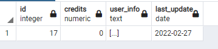

# FullStack-GO-React
 
This project its still a work in progress.

It already connects the backend to frontend using gorilla websocket and send a JSON

Its a simple Register/Login system with a persistent login

Already working:

* Sanitize passwords

* Hash passwords

* Register users with PostgreSQL

* Login users

* Persistent Login with Hashed Token

To Do:

* Implement an email verification.
* Better CSS and HTMl
* A way to spend credits and update info

I'll probably use a pretty simple html/css

Register Form with password sanitize.

Login Form

Front-End showing the info recived from backend through login using Token

User in DB

Token

user Information

